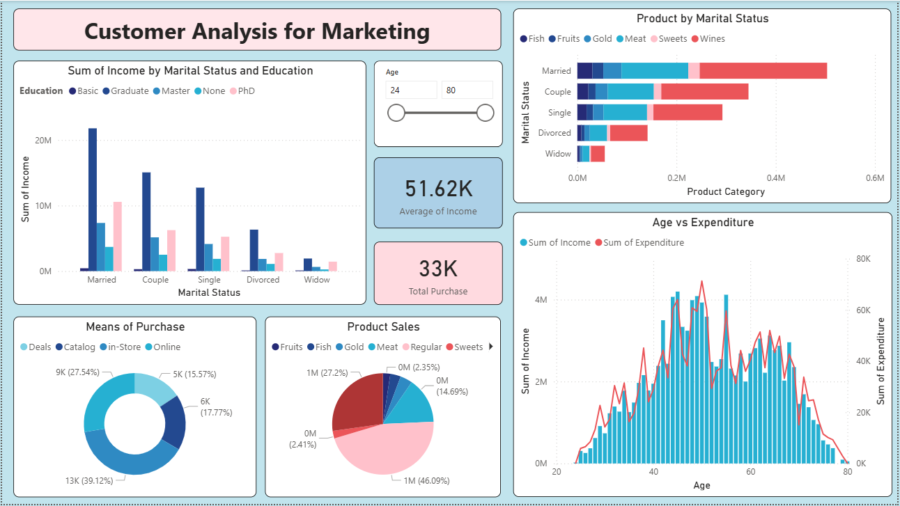
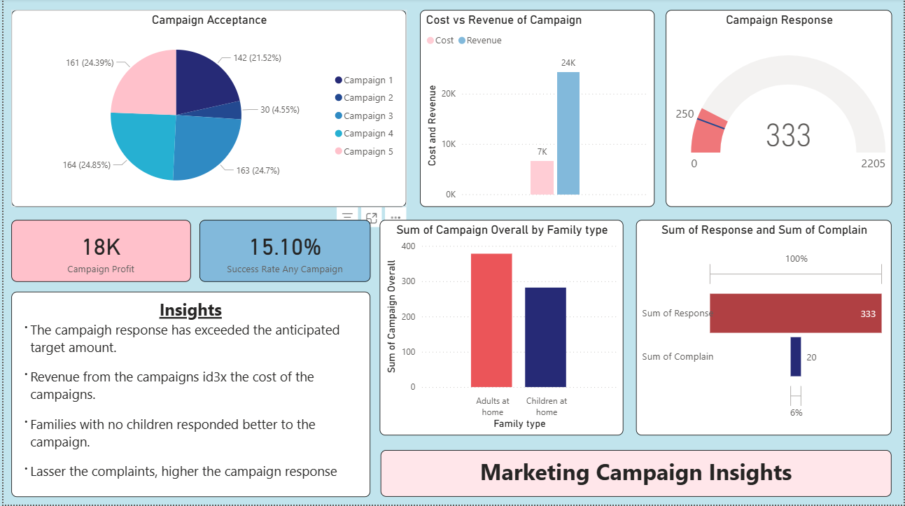

# Marketing Campaign & Customer Analysis (Power BI)

**The Challenge**
The marketing team relied on static Excel sheets and struggled to link campaign costs with actual revenue. They couldn't see which customer demographics were actually driving sales, which led to inefficient budget spending.

**The Solution**
I replaced the manual spreadsheets with a centralized Power BI analytical suite. I used Power Query to clean and transform raw Excel data, creating a reliable automated flow.

You can download and explore the full report file here: [📄 Marketing_Campaign.pbix](Marketing_Campaign.pbix)

---

## Dashboard 1: Customer Segmentation
Goal: Identify our most valuable customer groups.

**Key Insights & Logic:**
* **Income vs. Status:** The data showed that while PhD holders earn more on average, the "Married" segment actually generates the highest total sales volume.
* **Product Preferences:** A heatmap revealed a strong correlation between "Single" customers and "Electronics" purchases (based on the simulated dataset).
* **Demographic Filtering:** I added dynamic slicers (Age 24-80) to let the team easily compare generations (e.g., Gen Z vs. Boomers).

---

## Dashboard 2: Campaign ROI Tracker
Goal: Track marketing spend efficiency and return on investment

**Key Features:**
* **Real-time ROI:** Shows that revenue is currently ~3x higher than the campaign cost.
* **Smart Narratives:** I configured dynamic text summaries to help non-technical stakeholders instantly understand key trends (e.g., "Families responded better to this campaign") without analyzing charts deeply.
* **Success Rate KPI:** A clear visual gauge showing a 15.1% conversion rate against the 20% target.

---

## Technical Implementation

* **Data Modelling:** I built a Star Schema model instead of a single flat table to ensure fast performance and correct filtering logic.
* **DAX:** Used `CALCULATE`, `DIVIDE` (for safe division), and Time Intelligence functions to compare performance across different periods.
* **UX/UI:** Designed with a consistent color palette and "Card" visuals to ensure the report is readable on mobile devices.
